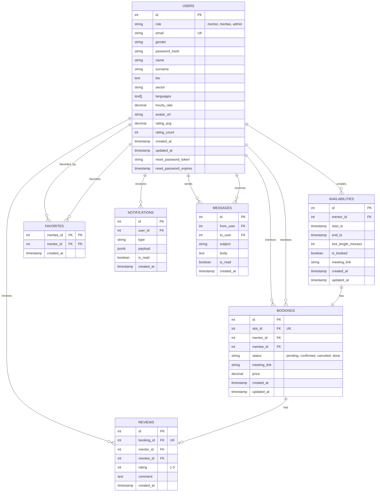

# Schema ER - MentorMatch

## Diagramma Entità-Relazione

## Descrizione delle Entità

| Entità | Descrizione |
|--------|-------------|
| **USERS** | Utenti del sistema (mentor, mentee, admin). Contiene info profilo, rating e credenziali |
| **AVAILABILITIES** | Slot di disponibilità creati dai mentor per offrire sessioni |
| **BOOKINGS** | Prenotazioni di sessioni (mentee prenota uno slot di availability) |
| **REVIEWS** | Recensioni lasciate dai mentee dopo una sessione completata (1 per booking) |
| **FAVORITES** | Relazione molti-a-molti per aggiungere mentor ai preferiti |
| **NOTIFICATIONS** | Notifiche agli utenti (booking confermato, cancellato, etc.) |
| **MESSAGES** | Messaggi tra utenti per comunicazione diretta |

## Relazioni Principali

1. **Users → Availabilities** (1:N) - Un mentor crea molti slot
2. **Availabilities → Bookings** (1:1) - Un slot ha massimo una prenotazione
3. **Bookings → Reviews** (1:1) - Una prenotazione ha massimo una recensione
4. **Users → Bookings** (1:N) - Un mentor/mentee può avere molte prenotazioni
5. **Favorites** (N:N) - Molti-a-molti tra mentee e mentor preferiti
6. **Notifications** (1:N) - Un utente riceve molte notifiche
7. **Messages** (1:N) - Un utente invia/riceve molti messaggi

## Vincoli Importanti

- **UNIQUE**: email (USERS), slot_id (BOOKINGS), booking_id (REVIEWS)
- **FOREIGN KEYS**: Cascata su DELETE per mantenere integrità referenziale
- **CHECK**: role IN ('mentor', 'mentee', 'admin'), rating 1-5
- **TRIGGERS**: Aggiornamento automatico di rating_avg e rating_count per mentor
